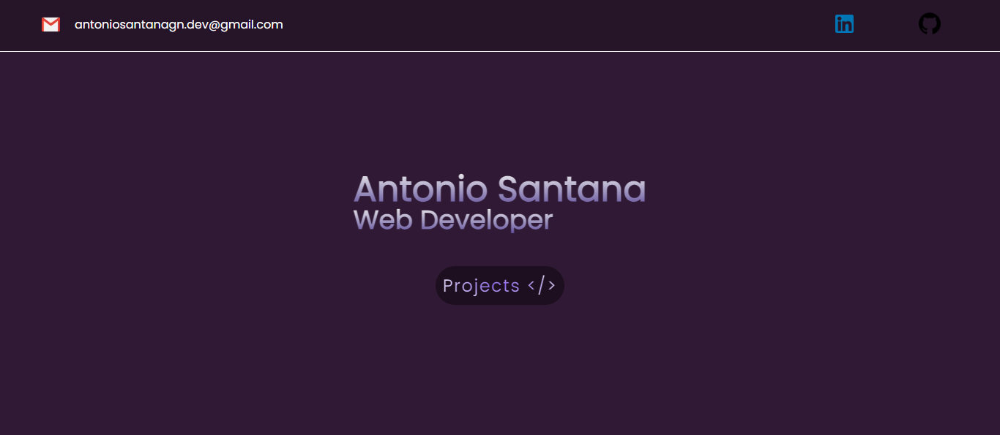

### 
Portfolio

> [!WARNING]\
> In development.

### Build With

| Framework / Lang | version |
| ---- | ---- |
| **Next** |  **14.1** |
| **React** | **18.0** |
| **TypeScript** | **5.0** |
| **Node.js** | **20.0** |